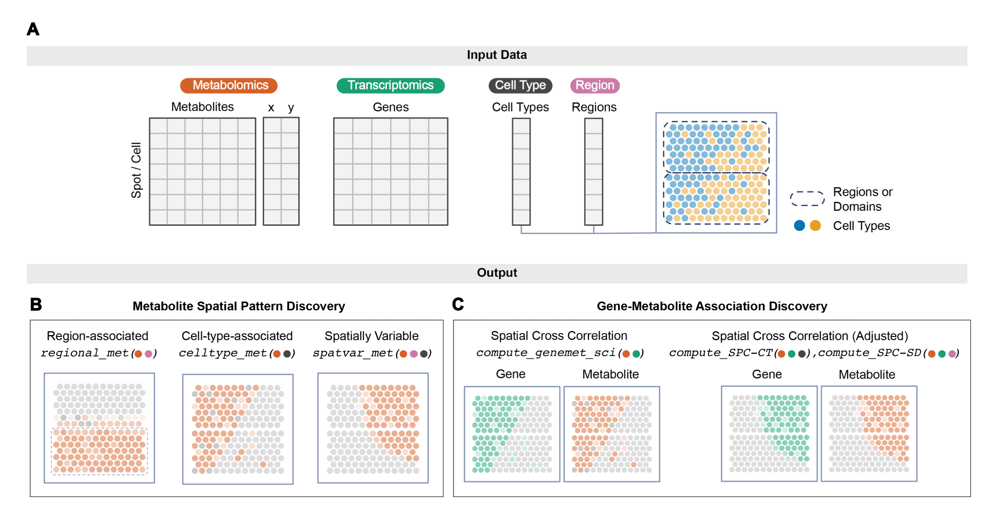

# MANTIS

Spatial Metabolomics (SM) technology enables spatially resolved characterization of metabolic states associated with tissue function. Its utility can be further enhanced by integration with a matched Spatial Transcriptomics (ST) profile. MANTIS is a downstream statistical analysis toolkit for paired and spatially aligned SM and ST data. It identifies metabolite spatial-distribution patterns and gene–metabolite relationships while accounting for spatial autocorrelation through specialized permutation procedures.

MANTIS can optionally incorporate spatial-domain annotations and cell-type labels or proportions to distinguish patterns associated with anatomical regions, cell-type composition, or other spatial factors.



---

## Terminology

- **SM — Spatial Metabolomics:** spatially resolved metabolite-abundance data.
- **ST — Spatial Transcriptomics:** spatially resolved gene-expression data.
- **SCI — Spatial Cross-Correlation Index:** a spatially weighted measure of association between a gene-expression profile and a metabolite-abundance profile.
- **SPC — Spatial Partial Correlation:** SCI calculated after adjusting the gene and metabolite profiles for specified covariates.
- **CT — Cell Type:** cell-type labels or estimated cell-type proportions.
- **SD — Spatial Domain:** anatomical regions or computationally identified spatial domains.
- **SPC-CT:** spatial partial correlation adjusted for cell-type effects.
- **SPC-SD:** spatial partial correlation adjusted for spatial-domain effects.

---

## Installation

MANTIS can be installed using pip:

```bash
pip install sc-mantis
```

---

## Input requirements

MANTIS is designed for downstream analysis and assumes that the following preprocessing steps have already been completed when applicable:

- SM and ST profiles have been spatially aligned;
- cell-type labels or cell-type proportions have been obtained;
- spatial domains have been annotated or computationally identified.

At minimum, users should provide:

- spatial coordinates for all spots or cells;
- a metabolite-abundance matrix.

Additional analyses require:

- a gene-expression matrix for SCI, SPC-CT, and SPC-SD;
- spatial-domain annotations for regional analysis and SPC-SD;
- cell-type labels or proportions for cell type-associated analysis and SPC-CT.

All files must use consistent spot or cell identifiers.

---

## Workflow

A detailed step-by-step tutorial is available in [MANTIS_tutorial.ipynb](tutorials/MANTIS_tutorial.ipynb).

### 1. Load the data

```python
import mantis as mt

mdata = mt.io.load_data(
    coords="spot_coordinates.csv",
    m_file="msi.csv",
    g_file="rna.csv",
    region="regions.csv",
)
```

- `coords`: spatial coordinates of the spots or cells;
- `m_file`: metabolite-abundance matrix with cells as rows and metabolites as columns;
- `g_file`: gene-expression matrix with cells as rows and genes as columns;
- `region`: spatial-domain annotation file with cells as rows.

Cell-type labels or proportions are required only for cell type-associated metabolite analysis and SPC-CT. See the detailed tutorial for how to add these annotations to the MANTIS data object.

### 2. Generate spatial-autocorrelation-preserving metabolite null maps

MANTIS generates randomized metabolite maps that preserve spatial autocorrelation for downstream significance testing.

Let `dmin` denote the shortest non-zero Euclidean distance between spatial cells. The default starting value for the null-map sampler is:

```text
l = 4 × dmin
```

mdata, G = mt.tl.sample(mdata, l=l)
```

The length scale `l` controls the spatial neighborhood used by the sampler:

- a smaller value emphasizes short range spatial dependence;
- a larger value incorporates more distant cells/spots and creates a broader spatial neighborhood;
- `4 × dmin` is the default starting value.

Users may examine nearby values when the relevant biological patterns occur at a substantially smaller or larger spatial scale. The spatial coordinates and `l` must use the same distance units.

### 3. Identify regional metabolites

This analysis identifies metabolites associated with spatial domains.

```python
mdata = mt.tl.compute_regional_metabolite(mdata, alpha=0.1)
```

- `alpha`: significance threshold used to report discoveries.

### 4. Identify cell type-associated metabolites

This analysis identifies metabolites associated with cell-type labels or estimated cell-type proportions.

```python
mdata = mt.tl.celltype_met(mdata)
```

### 5. Identify spatially variable metabolites

This analysis identifies metabolites with spatial patterns that remain after accounting for known cell-type and spatial-domain effects.

```python
mdata = mt.tl.spatvar_metabolite(mdata)
```

### 6. Compute the gene–metabolite Spatial Cross-Correlation Index (SCI)

SCI evaluates spatial association between gene expression and metabolite abundance.

```python
mdata = mt.tl.compute_genemet_sci(mdata)
```

### 7. Compute Spatial Partial Correlation adjusted for cell type (SPC-CT)

SPC-CT evaluates gene–metabolite spatial associations after adjusting both profiles for cell-type effects.

```python
mdata = mt.tl.compute_spc_ct(mdata)
```

### 8. Compute Spatial Partial Correlation adjusted for spatial domain (SPC-SD)

SPC-SD evaluates gene–metabolite spatial associations after adjusting both profiles for spatial-domain effects.

```python
mdata = mt.tl.compute_spc_sd(mdata)
```

For complete input preparation, parameter guidance, result interpretation, and output-saving examples, see the [step-by-step tutorial](tutorials/MANTIS_tutorial.ipynb).
